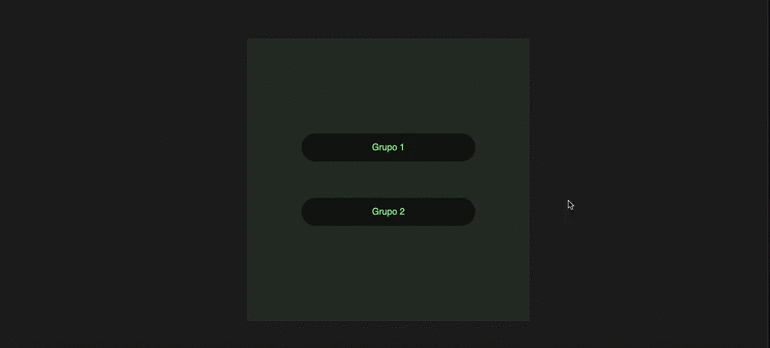
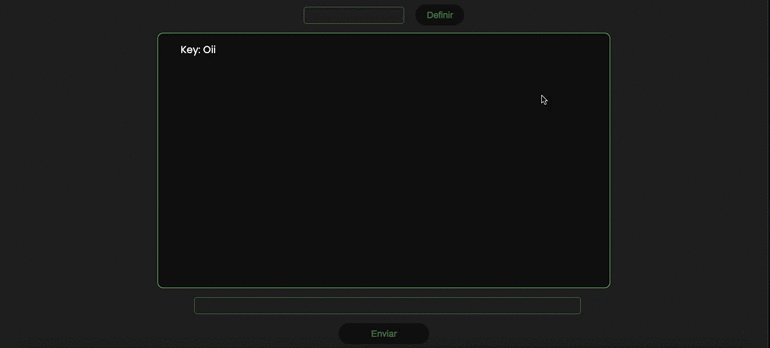

<h1 align="center">💬 Chat</h1>
<h2>📸 Preview:</h2>

<h1 align="center" >💻 O Projeto:</h1>

    Desenvolvido no curso de Desenvolvimento Web do ProrgamadorBR, esse
    projeto é um chat em tempo real entre usuários. Feito no módulo de Socket.io

Podem existir mais de uma sala/grupo para o chat.

<h1>Tecnologias:</h1>
<strong>✔️ HTML</strong>  
<strong>✔️ CSS</strong>  
<strong>✔️ JavaScript</strong>  
<strong>✔️ NodeJS</strong>  
<strong>✔️ Express</strong>  
<strong>✔️ SocketIO</strong>
